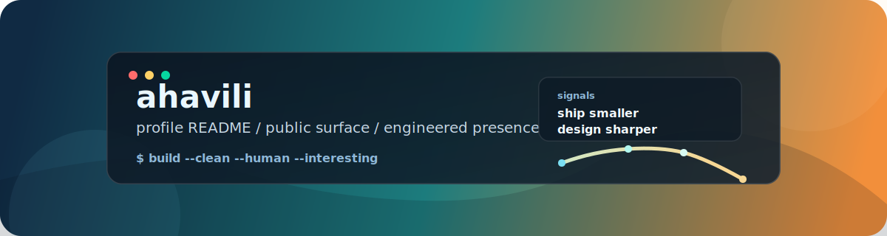
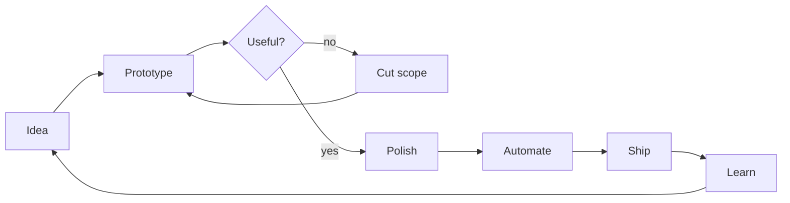

# <div align="center">A havili profile, but with actual intent.</div>

<p align="center">
  
</p>

<p align="center">
  
  
  
</p>

## `whoami`

I use this space like a lightweight control panel: what I care about, how I build, and what kind of work is worth a message.

## `./command-palette`

<details open>
<summary><strong>./now</strong></summary>

```text
> building useful things
> refining taste in code and interface design
> keeping complexity lower than it first appears
```

</details>

<details open>
<summary><strong>./build-style</strong></summary>

```text
+ ship small increments
+ prefer clarity over ceremony
+ automate repetitive work
+ make interfaces feel intentional
```

</details>

<details>
<summary><strong>./toolbox</strong></summary>

```text
languages: javascript, typescript, python, sql
runtime: node, browser, cli
interests: product engineering, developer tooling, systems thinking
```

</details>

## `./how-i-think`



## `./connect`

If you want to collaborate, open an issue, start a discussion, or fork something interesting and make it stranger.
